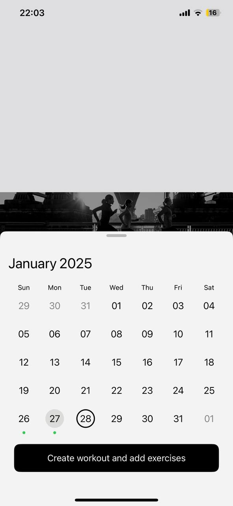

# Fitness Pad: Workouts and Food days

## Description

**FitnessPads**  is an advanced workout diary application designed for fitness enthusiasts who want to take their physical training to the next level. This app helps users plan workouts, track exercises, record weights and repetitions, and analyze exercise progress over time.

## Key Features

- **Workout Planning:** Easily create and manage workout plans tailored to your fitness goals.  
- **Diet Planning:** Plan and track your daily meals and nutrition to complement your fitness goals, ensuring a balanced approach to health and wellness.  
- **Exercise Tracking:** Log exercises, including weights, repetitions, and sets, to monitor your performance.  
- **Progress Analysis:** Visualize your progress with detailed charts and statistics, helping you stay motivated and on track.  
- **User-friendly Interface:** The intuitive and sleek design ensures a seamless user experience.  
- **Customizable Workouts:** Add custom exercises and routines to fit your unique fitness regimen.  
- **Data Visualization:** View your workout history and progress in an easy-to-read format, making it simple to track improvements.  

- ## Screenshots

### Login Screens

<table>
  <tr>
    <td align="center"></td>
    <td align="center"></td>
    <td align="center"></td>
    <td align="center"></td>
    <td align="center"></td>
    <td align="center"></td>
    <td align="center"></td>
    <td align="center"></td>
    <td align="center"></td>
    <td align="center"></td>
  </tr>
</table>
